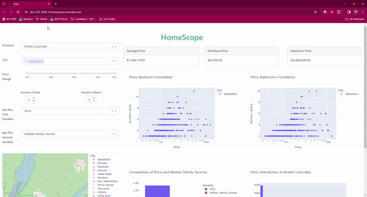
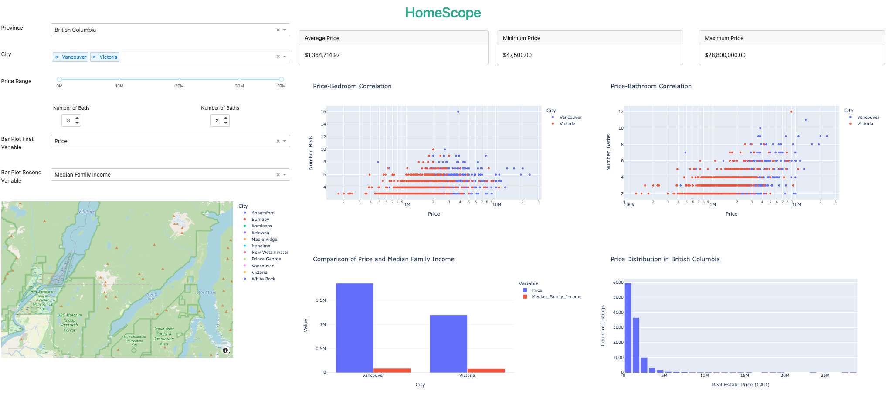

# DSCI-532_2024_5_HomeScope

## Welcome!

First and foremost, welcome! 🎉 Willkommen! 🎊 Bienvenue! 🎈

Thank you for visiting the `HomeScope` project repository. This README file is a hub that provides essential information about our project. Feel free to jump straight to one of the sections below, or simply scroll down to learn more.

-   [Who are we?](#who-are-we)
-   [What are we doing?](#what_are_we_doing)
-   [Get Support](#get_support)
-   [Collaboration](#Collaboration)
-   [Join Our Journey](#joinus)
-   [Data Sources and Licensing](#data_sources_and_licensing)
-   [Setup for Local Development](#setup)
-   [Contributing](#Contributing)
-   [Thank You](#thankyou)
-   [Understand the jargon](#glossary)


## Who Are We? {#who-are-we}

Our `HomeScope` team, comprised of adept developers and data scientists, is driven by a shared passion for inclusivity and technology. Our expertise in data analysis underpins our commitment to this project.

### Project Summary

`HomeScope` is an analytical platform dedicated to illuminating the real estate market's complexities. Aimed at stakeholders such as investors, developers, market analysts, and urban planners, it provides actionable insights through the careful analysis of pivotal variables influencing property values.

### Motivation and Purpose

As a data analytics team within a real estate development company, we strive to provide our target audience with a comprehensive tool that elucidates the various determinants of property prices.

### The Challenge

The real estate domain is intricate, often characterized by opaque market dynamics. There's a pronounced need for transparency, especially for under-represented groups seeking equitable access to market insights.

### Dashboard Features

With `HomeScope`, you can explore market trends, compare housing attributes across cities, and view real-time price distributions, all through an interactive and intuitive interface.

### The Solution

Our `HomeScope` dashboard is an empowering tool that enables:

-   The exploration of housing data with customizable features and filters.
-   Community-driven contributions to our database, fostering growth and inclusivity.
-   The synthesis of valuable insights to facilitate well-informed real estate decisions.

## What are we doing? {#what_are_we_doing}

### The Dashboard



The current iteration of `HomeScope` boasts:

-   Interactive filters for localized real estate data analysis.
-   Correlative scatter plots elucidating the influence of property features on pricing.
-   An interactive map to visualize geographical data and price distributions.
-   Comparative visualizations that convey a thorough market overview.

### Dashboard Design (Milestone2)



### Forward Vision

We are poised to refine `HomeScope` further, enhancing its interactivity and user interface. Our ambitions include the integration of advanced predictive analytics and the expansion of our dataset to encompass global markets.

## Get Support {#get_support}

Encountered an issue or have a question? Feel free to [open an issue](#issues-link) in this repository, and our team will be happy to assist you.

## Collaboration {#collaboration}

Our project is a collaborative endeavor, with each team member playing a pivotal role:

-   [Iris Luo](https://github.com/iris0614)
-   [Aishwarya Nadimpally](https://github.com/Aishwarya120111)
-   [Carrie Yan](https://github.com/carrieyanyi)
-   [Nasim Ghazanfari Nasrabadi](https://github.com/nassimgha)

## Join Our Journey {#joinus}

Dive into `HomeScope` and join us in forging a more transparent and inclusive real estate landscape.

### Data Sources and Licensing {#data_sources_and_licensing}

### Data Sources

Our analysis is anchored in a robust dataset, `Canadian house prices for top cities`, obtained from `Kaggle`. You can find it [here](https://www.kaggle.com/datasets/jeremylarcher/canadian-house-prices-for-top-cities).

### Licensing

The `HomeScope` codebase is MIT licensed, as found in the [LICENSE.md](LICENSE.md) in this repository.

## Setup for Local Development {#setup}

To run `HomeScope` locally:

1.  **Clone the Repository**

    Clone the repository using Git:

    ``` bash
    git clone git@github.com:UBC-MDS/DSCI-532_2024_5_HomeScope.git
    ```

2.  **Navigate to the Project Directory**

    Change into the project directory:

    ``` bash
    cd DSCI-532_2024_5_HomeScope
    ```

3.  **Create a Conda Environment**

    Create a Conda environment named 532_HomeScope using the environment.yaml file. This file contains all necessary dependencies:

    ``` bash
    conda env create -f environment.yaml
    ```

4.  **Activate the Conda Environment**

    Activate the newly created environment:

    ``` bash
    conda activate 532_HomeScope
    ```

5.  **Run the Application**

    Start the application with the following command:

    ``` bash
    python ./src/app.py
    ```

This will launch the application, typically at <http://127.0.0.1:8050/> in your web browser.

By following these instructions, you'll be able to set up and run the `HomeScope` application locally, with all the required dependencies installed via the `532_HomeScope` Conda environment.

## Contributing {#contributing}

Your contributions are what make the open-source community such an amazing place to learn, inspire, and create. Any contributions you make are **greatly appreciated**. Please read our [Contribution Guidelines](CONTRIBUTING.md) for details on our code of conduct and the process for submitting pull requests to us.

## Thank You {#thankyou}

Thank you so much (Danke schön! Merci beaucoup!) for visiting our project. We hope you'll join us on this exciting journey to empower stakeholders in the real estate sector with HomeScope.

## Glossary {#glossary}

-   README file: A document introducing an open project to the public and potential contributors, typically including installation, usage, and contribution information.
-   Repository (or Repo): A collection of documents related to your project, where you create and save new code or content, often hosted on platforms like GitHub or Bitbucket.
-   Roadmap: A document outlining the planned schedule of work for a project.
-   Milestone: An event or state marking a significant stage in development within the project.
-   Issue: The GitHub term for tasks, enhancements, bugs, discussions, and questions related to your projects.
