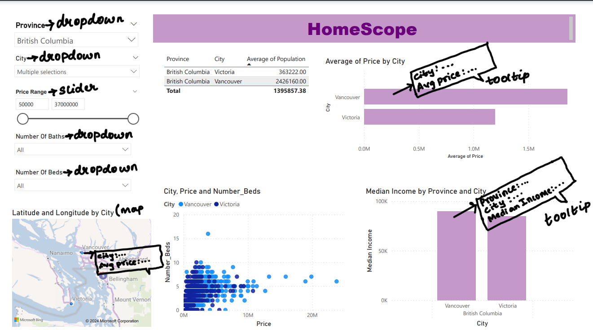

# DSCI-532_2024_5_HomeScope

## Project Summary

HomeScope is a data analysis project aimed at providing stakeholders in the real estate industry with actionable insights derived from comprehensive analysis of key variables. Through meticulous examination of factors such as city, number of beds and baths, population, and median family income, our dashboard seeks to illuminate the intricate dynamics influencing property prices. By unraveling these complexities, stakeholders can make informed decisions regarding property investments, pricing strategies, and market positioning.

## Dashboard Design (Draft)

## Contributors

-   Iris Luo
-   Aishwarya Nadimpally
-   Carrie Yan
-   Nasim Ghazanfari Nasrabadi

## Dataset

The dataset is distributed under the **Creative Commons 1.0 Universal License** ([CC BY 1.0](https://creativecommons.org/publicdomain/zero/1.0/)).

## License

The app code contained within this repository is licensed under the MIT license. See [the license file](LICENSE.md) for more information.
