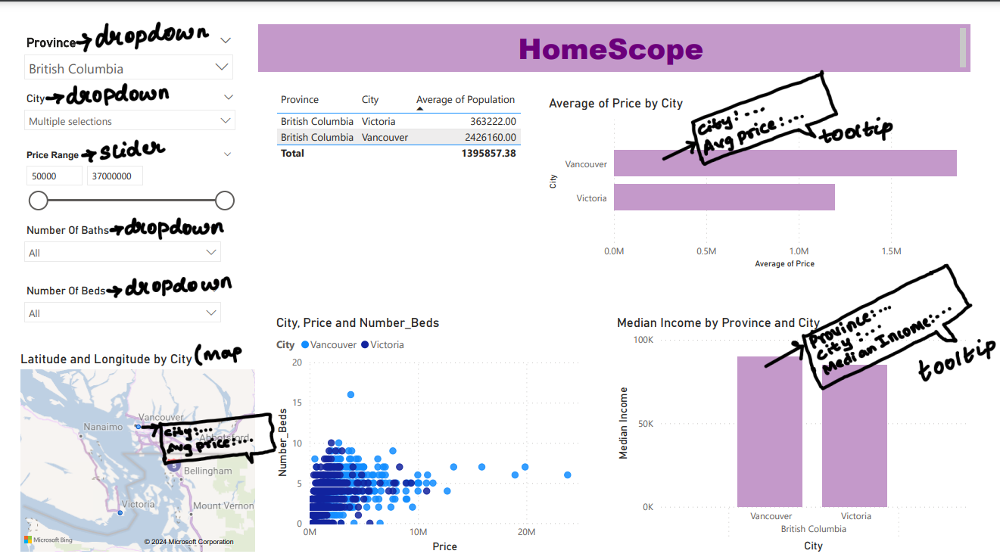

# DSCI-532_2024_5_HomeScope
## Motivation and Purpose:
$Our role$: We are the data analytics team within a real estate development company.
$Target audience$: Our dashboard is designed for real estate investors, developers, market analysts, and urban planners.

### Motivation
In today's dynamic real estate landscape, various factors significantly impact property values and market dynamics. Investors and developers seek insights to navigate these complexities effectively. Understanding regional trends, demographic shifts, and economic indicators is crucial for making strategic investment decisions.

### Purpose:
Our dashboard serves as a powerful tool for real estate stakeholders, offering in-depth analysis of key variables driving property prices. By exploring factors such as city-specific trends, property characteristics (number of beds and baths), population dynamics, and median family income, we provide nuanced insights that transcend surface-level observations.

By harnessing the power of data visualization and analytics, our dashboard enables users to:

- Identify lucrative investment opportunities: By analyzing city-specific trends and demographic patterns, investors can pinpoint emerging markets with high growth potential and strategic value.

- Mitigate risk and optimize returns: Understanding the relationship between property characteristics and market demand allows developers to tailor their projects to meet the needs of target demographics, reducing vacancy rates and maximizing ROI.

- Inform urban planning decisions: Urban planners can leverage insights from our dashboard to identify areas experiencing population growth and changing socio-economic dynamics, guiding infrastructure development and zoning policies.

- Enhance market intelligence: Analysts and industry professionals can stay ahead of market trends by continuously monitoring key variables and adapting strategies to capitalize on evolving market conditions.

In essence, our dashboard empowers real estate stakeholders with actionable insights derived from comprehensive data analysis. We aim to bridge the gap between complex market dynamics and practical decision-making to drive sustainable growth and prosperity within the real estate industry.

## Section 2: Description of the data

We will present a visual analysis of a dataset encompassing 35,768 real estate prices from 2023, focusing on the 45 most popular Canadian cities as identified by the 2021 census. Each real estate relates to nine distinct features, playing a critical role in determining its market value. Features are categorized based on functions as following:

\- House location: \`Province\`, \`City\`, \`Address\`, \`Latitude\`, \`Longitude\`

\- House structure: \`Number_Beds\`, \`Number_Baths\`

\- Social aspects: \`Median_Family_Income\`, \`Population\`

Based on these given features, our analysis will extend to calculate the average property prices within each city, subsequently ranking them by provinces to facilitate a more detailed data exploration. Investigations such as analyzing the relationship between a city's median income and house pricing will also enhance our client's interpretation of the fluctuating market. We believe that data exploration acts as the foundation supporting visualizations and more data analysis will be conducted during this process as needed.

## Section 3: Research questions and usage scenarios
Affordability Assessment: What is the relationship between median family income and housing prices in different cities, and how does affordability vary across provinces?

Features Impact Evaluation: How do the number of bedrooms and bathrooms affect the market value of a property in urban versus suburban areas?

Comparative Analysis: How do property prices compare within each province and between provinces, taking into account the population and median family income?

Geospatial Distribution: Is there a spatial pattern to the real estate prices when mapped against the longitude and latitude data provided, possibly indicating real estate price clustering?

Investment Opportunity Identification: In which cities do the real estate prices appear to be undervalued relative to the median family income and population, potentially indicating good investment opportunities?

### Persona description
Name: Jacob Tremblay
Role: Real Estate Analyst at a Canadian Urban Development Firm
Background: Jacob has extensive experience in urban planning and real estate market analysis. His firm is tasked with advising local governments on development policies that align with market trends and housing affordability initiatives.
Goal: To gather insights on the real estate market across Canada's most populous cities to inform development policies and investment strategies.

### User story and usage scenario
Jacob logs onto the "HomeScope" dashboard with the goal of [identifying] market trends and [assessing] the impact of demographic factors on housing prices. He aims to [compare] various housing markets and [extract] actionable data to support urban development plans.

### As he navigates the dashboard:
Exploring the Map: Jacob starts by exploring the interactive map, hovering over cities to see a tooltip with the average house price and clicking on cities for more in-depth statistics. This immediate visual assessment helps him [identify] regions with the highest market activity.
Filtering Data: Utilizing the filter panel, he [narrows] down his search to cities with a median family income below a specific threshold, aiming to understand affordability issues. He adjusts sliders for the number of bedrooms and bathrooms to reflect typical family homes.
Viewing Listings: He scrolls through the listings that match his filters, [noting] properties that are outliers in terms of price, which could indicate a potential for market correction.
Taking Action: Based on the dashboard's data, Jacob [concludes] that certain cities show a concerning disparity between income and housing prices. He decides to [recommend] targeted policy interventions in these areas, such as development incentives for affordable housing.
By using the "HomeScope" dashboard, Jacob is able to [synthesize] comprehensive data into a clear narrative for his firm's consulting services. This leads to data-driven recommendations that can shape future urban development and real estate investment, ensuring that policies are responsive to actual market conditions.

## Section 4: App sketch and description

The "HomeScope" dashboard is an analytical tool for the real estate market. It features multiple user interface elements such as dropdown menus for selecting Province and City (with a facility to select multiple cities), and sliders for adjusting Price Range. There are also dropdowns for filtering by Number Of Baths and Beds. Data Visualization includes a map labelled "Latitude and Longitude by City" possibly representing property locations in cities. Horizontal bar chart for Average Price by City shows the average property prices in different cities. A scatter chart titled "City, Price and Number_Beds" correlating prices with the number of bedrooms, and a bar chart comparing Median Income by Province and City. For all the plots the presence of tooltips gives users additional information on the charts.

Overall, the dashboard is designed to give real estate professionals or potential buyers a comprehensive overview of the housing market, with interactive elements that allow for a customized data exploration experience. 
